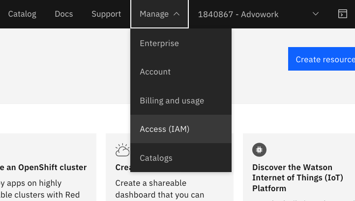
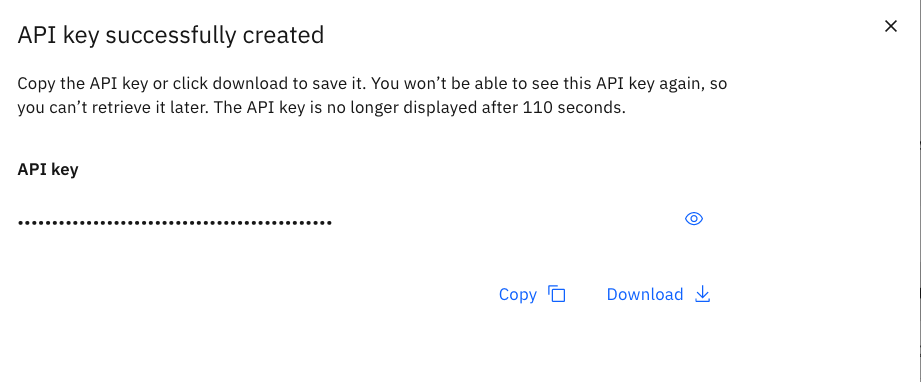
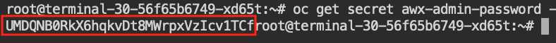
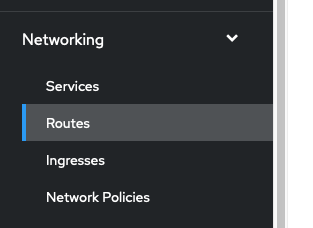
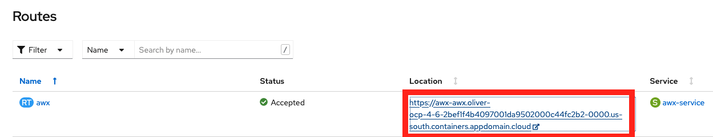
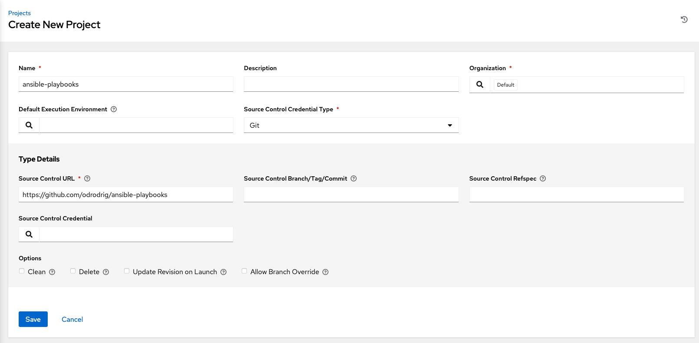
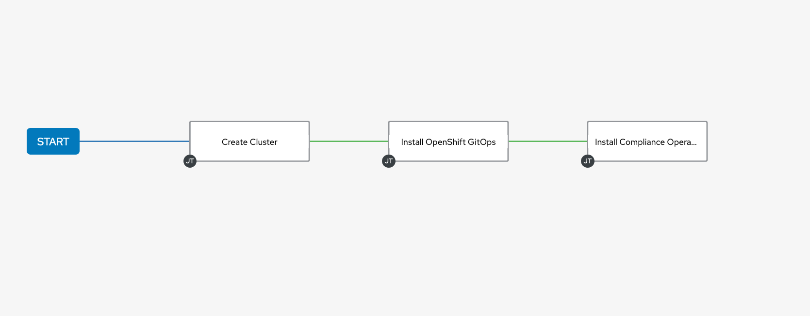
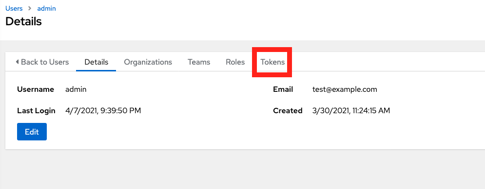
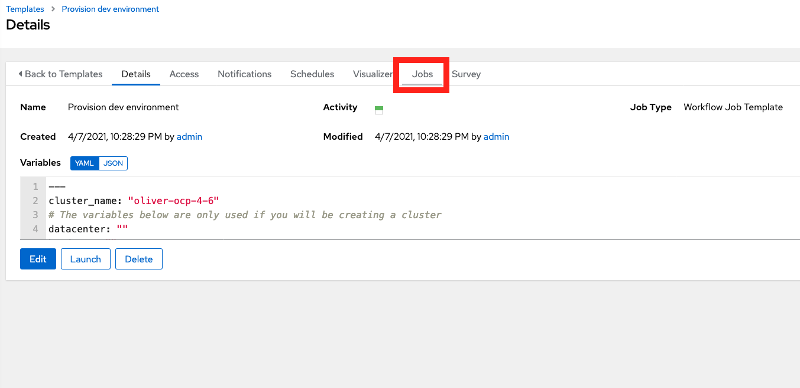

# Cloud Native Infrastructure as Code and Configuration Management

In this lab we will be exploring the concepts of Infrastructure as code and configuration management in the scope of cloud native development.

Traditionally, infrastructure as code (IaC) mainly referred to provisioning virtual machines across datacenters and cloud providers, however, as we move to a more cloud native strategy involving container orchestration on public clouds, this provisioning process looks different. With the popularity of hosted kubernetes and OpenShift offerings on public clouds, it is easier than ever to provision a platform on which to deploy contianerized applications.

In this lab we will walk through the automated provisioning of an OpenShift cluster on IBM Cloud, configuring that cluster with common development tooling, and then finally deploying an application to that cluster. We will be utilizing Ansible to provision and configure our environment as well as the open source project AWX to manage the Ansible playbook runs.

## Prerequisites

- IBM Cloud Account: [Create a free account here](https://cloud.ibm.com/registration)

## Getting access to the workshop environment

In this workshop we will be giving you an OpenShift cluster to work on. To access the workshop cluster, follow these steps:

1. Navigate to [https://ansible-lab.mybluemix.net](https://ansible-lab.mybluemix.net) and enter you IBM ID (email used to create IBM Cloud account) and the lab password of `oslab`.

1. After requesting a cluster you should be given a link to take you to the workshop cluster in an IBM Cloud Account. Click on the link. Remember what number cluster you were assigned, we will need this later.

1. We will be using a web terminal environment so that participants can have access to the necessary cli tools without having to install anything. To access this environment, find your assigned number. This should be in the cluster name that you were assigned earlier when you requested a workshop environment. 

The url to access the terminal environment follows this structure: base url + "/term" + assigned number without the leading `0`s

The base url for everybody will be: `https://oliver-citi-terms-2bef1f4b4097001da9502000c44fc2b2-0000.us-south.containers.appdomain.cloud`

For example, if I was assigned `cluster-030` my url would be `https://oliver-citi-terms-2bef1f4b4097001da9502000c44fc2b2-0000.us-south.containers.appdomain.cloud/term30`


## 1. Setup the environment

### Authenticate to your OpenShift cluster
1. Now let's authenticate with our OpenShift cluster. Navigate to your openshift Cluster in IBM Cloud using the link given to you after requesting a cluster.

1. Click on the cluster listed to be taken to the cluster overview page.

1. Click on the `OpenShift web console` button to launch the console.

1. From the console, click on the username at the top right of the page and select `Copy Login Command`

    

1. Then, click on `Display token`

    

1. Next, copy everything in the first box that contains the `oc login` command.

    

1. Switch back to your terminal environment and paste in your oc login command.

    You should now be authenticated and targeting your OpenShift cluster.

### Get an API key from IBM Cloud

Now we need to get an IBM Cloud api key to access our account from the terminal.

1. Go back to your browser tab that is on IBM Cloud.

1. In the top right of the page, select the `Manage` dropdown, and select `Access (IAM)`

    

1. Then select `API keys` on the left of the page.

1. Click on the `Create an IBM Cloud API key` button. Name the key `awx` or whatever you wish. Click `create`.

1. Then, click on the `Copy` button to copy the new key. Paste this key in a temporary doc for now or save it in a key manager. We will use this later.

    It is important that you verify that you have the key somewhere else because once you close the window with the api key, you cannot retrieve it later. If you lose your key you will need to come back and create another one.

    

1. Switch back to your terminal environment. 

1. In your terminal enviroment, create an environment variable to hold your api key

    ```bash
    export IC_API_KEY=api key here
    ```

    Press enter.

    This will be used by our ansible playbook.

### Cloning the repo

1. In the terminal environment, run the following commands:


    ```bash
    cd ~

    git clone https://github.com/odrodrig/ansible-playbooks.git

    cd ansible-playbooks/playbooks
    ```

## 2. Running Ansible Playbooks

Now that we are in our terminal environment, let's try running some simple playbooks.

Playbooks allow users to script out tasks to be automated. You can run them by calling the `ansible-playbook` tool.

1. Run the ansible playbook `helloWorld` by running the following command:

    ```bash
    ansible-playbook helloWorld.yml -v
    ```

## 3. Installing AWX

1. From your terminal, run the following commands to install the AWX operator replacing `cluster name here` with the cluster name that you were assigned:

    ```bash
    echo "cluster_name: cluster name here" > vars.yml

    ansible-playbook installAWX.yml -v
    ```

    This playbook will do a few things:

    - Get our cluster information from IBM Cloud
    - Authenticate to our cluster using an API key from IBM Cloud
    - Install the AWX operator
    - Create a new project called "awx"
    - Create an instance of AWX in our awx project

## 4. Configuring AWX

Now that we have AWX installed, let's configure it to manage the running of our playbooks.

### Accessing AWX

1. First we need to get our admin password to log into AWX. From your terminal, run the following commands:

    ```bash
    oc project awx

    oc get secret awx-admin-password -o jsonpath="{.data.password}" | base64 --decode
    ```

    The password will be output but unfortunately the terminal prompt gets in the way. Copy the password up until the word `root` as seen below.

    

1. Next, go back to your OpenShift console, click on `Networking` on the left side of the page to expand the menu and select `Routes`

    

1. Then select the link under the `Location` column for the `awx` route.

    

1. You will then be taken to your AWX login page. The credentials are as follows:

    ```bash
    username: admin
    password: {what you copied earlier}
    ```

    Click login to be taken to your AWX dashboard.

### Adding a project

1. The first thing we need to do now is import our playbooks into our AWX environment. We can do this by creating a `Project` and pointing it to a git repository. Navigate to the `Projects` tab on the left side of the page.

1. Then, click on the blue `Add` button.

1. Name it `ansible-playbooks` or whatever you like, and for the `Source Control Credential Type` dropdown, select `Git`.

    In `Source Control URL` enter the following repo:

    ```bash
    https://github.com/odrodrig/ansible-playbooks
    ```

    Lastly, select the checkbox labeled 'Update Revision on Launch`

    Your project should look like the image below.

    

    Click `Save`

### Configuring Job Templates and Workflow Job Templates

1. Now that we have imported our playbooks, we need to create job templates for each playbook we want to run.

1. On the left side of the page, select the tab for `Templates`.

1. Click on `Add` and select `Add job template`

1. Configure the template with the values below. For the `Inventory` and `Project` fields you will need to click on the magnifying glass to select values.:

    - Name: Create Cluster
    - Inventory: Demo Inventory
    - Project: ansible-playbooks (or whatever you named your project)
    - Playbook: playbooks/create.yml

    Click `Save`

1. Create another job template just as you did before with the following values:

    - Name: Install OpenShift GitOps
    - Inventory: Demo Inventory
    - Project: ansible-playbooks
    - Playbook: playbooks/installOpenShiftGitOps.yml

    Click `Save`

1. Create one more job template just like before with the following values:

    - Name: Install Compliance Operator
    - Inventory: Demo Inventory
    - Project: ansible-playbooks
    - Playbook: playbooks/installComplianceOperator.yml

    Click `Save`

1. Each job template corresponds to a playbook that does one task. If we want to combine multiple jobs into one process, we will need a workflow job template.

    The workflow that we will be building will create a cluster, install OpenShift GitOps, and lastly install the Compliance Operator.

    From the `Templates` menu, click on `Add` then select `Add workflow template`

1. Name the workflow template `Provision dev environment`

1. Then, in the `Variables` section, paste in the variables below. Be sure to replace `{your cluster name here}` with your actual cluster name.

    ```yaml
    ---
    cluster_name: "{your cluster name here}"
    # The variables below are only used if you will be creating a cluster
    datacenter: ""
    hardware: ""
    kube_version: ""
    public_vlan_id: ""
    private_vlan_id: ""
    default_worker_ppol_size: ""
    entitlement: ""
    ```

    Click `Save`

1. You will then be taken to the workflow visualizer tool that allows us to string together job templates as part of a workflow. Click on the green `start` button.

1. In the new `Add Node` window that appears select the `Create Cluster` job template. Click Save.

1. Now you should see your workflow with one node connected to the Start node. Select the `Create Cluster` node and click on the plus (+) sign to add a new node.

1. Select the `On Success` box and click next.

1. Then select the `Install OpenShift GitOps` job template and click `Save`.

1. Let's add one more node. Select the `Install OpenShift GitOps` node and click on the plus (+) sign.

1. Select the `On Success` box and click next.

1. Then select the `Install Compliance Operator` job template and click `Save`.

    Your workflow should look like the image below:

    

1. Click on `Save` at the top right of the workflow visualizer page.

### Adding a custom container group
In our AWX instance, each job run will run in a separate container on our cluster. To configure this we need to create whats known as a `Container Group`. When we create our container group we will specify what image we want to use for our job runs.

1. Click on the `Instance Groups` tab on the left side of the page.

1. Then click on the existing container group called `tower` and click on the `Edit` button.

1. Select the checkbox under `Options` labeled  `Customize pod specification`.

1. In the custom pod spec field, overwrite what's there and paste in the following **but do not save yet**:

```yaml
apiVersion: v1
kind: Pod
metadata:
  namespace: awx
spec:
  containers:
    - image: docker.io/odrodrig/ibmcloud-ee:0.3
      name: worker
      env:
        - name: IC_API_KEY
          value: "xxx"
      args:
        - ansible-runner
        - worker
```

1. In the custom pod spec that was just pasted in, add your IBM Cloud api key to the `value` property of the `IC_API_Key` env variable replacing the `xxxx`.

1. Click `Save`

## 5. Running Jobs on AWX

Now that our instance of AWX is configured, let's start running these playbooks. In this section we will explore two different ways to run our jobs.

### Manually running a Job

1. Click on the `Templates` tab on the left of the page.

1. Find the job template called `Install Compliance Operator` and click on it.

1. Click on the `Edit` button.

1. In the job template scroll down to the `Variables` section and paste the following line in:

    ```bash
    cluster_name: "cluster-name"
    ```

    Replace `cluster-name` with the cluster name that you were assigned.

1. Scroll down and click `Save`

1. Now, click on the `Launch` button to launch a job utilizing this job template.

    You should now be taken to the output page of the job that we just launched. Wait here until the job completes.

While we can launch our jobs and workflow jobs manually from AWX, it would be better if we could set it up so that the jobs could be triggered without needing a human to log into AWX and click the launch button.

### Launching a job via API

One of the benefits of using AWX/Ansible Tower is the ability to launch jobs via API request. This allows you to integrate your workflow runs into other processes. For example, a self serve form to request access to a new OpenShift development environment could trigger a workflow run in AWX.

1. Click on `Templates` on the left side of the page to go back to the templates page.

1. Select the `Provision dev environment` workflow job template

1. Go to the address bar of your browser and go to the very end of the address. Look for the number just before `/details`. This is the workflow job template id and is needed to launch the job from the API. For example, in the partial address below, my workflow job template number is 21. Remember your number.

```string
...us-south.containers.appdomain.cloud/#/templates/workflow_job_template/21/details
```

1. Next, we need to create a token that will allow our API calls to be authorized with AWX. Click on `Users` on the left side of the page.

1. Click on `Admin`

1. Click on the `Tokens` tab

    

1. Click `Add`

1. In the `Scope` dropdown select `Write` and leave the other fields empty. Click `Save`

1. In the new window that appears copy the token that is displayed and save it in a temporary scratch pad or text file. This is the only time the token will be visible. If you lose it, you will need to generate a new one.

1. For this lab we will keep things simple and use `curl` to launch our workflow job. Go back to your terminal environment.

1. Let's construct our `curl` request. Copy and paste the curl command below into a scratch pad or text file so that it is easy to modify.

    ```bash
    curl -X POST \
    AWX_ROUTE/api/v2/workflow_job_templates/JOB_TEMPLATE_NUMBER/launch/ \
    -H 'Authorization: Bearer AWX_TOKEN' \
    -H 'Content-Type: application/json' \
    -d '{
        "extra_vars": {
            "cluster_name": "CLUSTER_NAME"
        }
    }
    '
    ```

    Replace the following:

    - AWX_ROUTE - This is the address of the link that you clicked on to access AWX. You can find it by going to the OpenShift Console and looking at the route in the awx project.

    - JOB_TEMPLATE_NUMBER - This is the workflow job template number that we got in step 3 above.

    - AWX_TOKEN - This is the personal access token we just created in AWX for the Admin user.

    - CLUSTER_NAME - This is the name of the cluster you were assigned. You can find this on IBM Cloud.

1. Once you have all of the values replaced in your curl command, copy and paste it into your terminal environment and press enter.

1. Return back to AWX in your browser and cilck on the `Templates` tap on the left.

1. Click on the `Provision dev environment` workflow job template

1. Click on the `Jobs` tab. You should now see a job running that was started via API call.

    

1. Click on the job title to view the job output.

## Conclusion

In this lab we explored how we can use Ansible playbooks to automate environment provisioning and configuration with Ansible and AWX/Ansible Tower. We tried three different methods of running our playbooks: manually using `ansible-playbook`, launching the jobs in AWX manually, and triggering jobs via API calls.